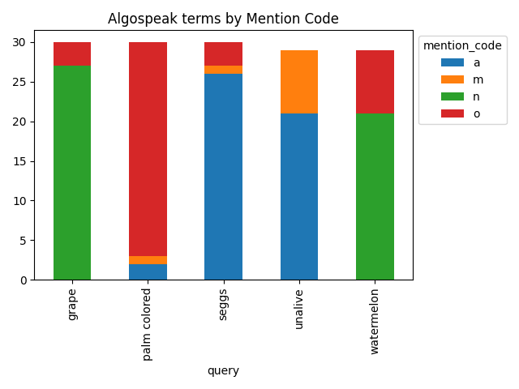

# Final Report - Algospeak on Bluesky
Sara Rosenau
shr144@pitt.edu
4/29/2025

## Background
Today, social media websites and applications are often algorithmically driven. This means that while users can search for content and find content from creators they choose to follow, for the most part, users access content suggested to them by the social media website through code created to sort posts and present them graphically to the user, usually in a single direction such as left to right or vertically. The code that each platform uses is unique to that platform, proprietary, and changes frequently without notice to the users. This code is also opaque and secret, entirely unknown to the userbase and anyone other than the application’s developers. The posts that are shown to users by this code are typically known as algorithmically driven recommendations. 

Social media sites such as TikTok, YouTube, and Twitter/X have been suspected to suppress or remove advertising revenue, known as demonetization, from content containing certain keywords using their algorithms. For example, in 2017, YouTube instituted new, and vague, guidelines about content that might be seen as “Not Advertiser-Friendly”, enforced by AI scanning videos for such content (Dunphy, 2017). Terms of Service agreements for social media platforms can sometimes state that terms referring to suicide and eating disorders may be banned. For example, the TikTok Community guidelines do “not allow showing, promoting, or sharing plans for suicide or self-harm”, disordered eating, or “dangerous activity and challenges” (Community Guidelines | TikTok, 2024).  The removal and suppression of such topics nominally serves to protect the mental health of the user base, especially if it contains many younger people, and also protects the corporation from lawsuits and advertiser boycotts. For instance, if “suicide” is searched on the app, a mental health warning with suicide hotlines will appear.

To circumvent algorithmic suppression and content moderation, social media users have started using what is called *algospeak*. Algospeak was coined by journalist Taylor Lorenz (2022) as a strategy of self-censorship by using alternate words, symbols, and signs to avoid using words that are commonly thought to lead to posts being suppressed by the algorithm. This can surface in several ways, such as using a white emoji (⚪) to represent white people, replacing words with similar characters like *lesbian* becoming *le$bean*, using productive morphology like *unalive* replacing kill and dead, or changing the spelling slightly like *seggs* replacing *sex*. 

This study will be looking at how algospeak is used on the social media platform Bluesky. Bluesky was first launched to users in 2023, primarily marketed as a Twitter replacement after Twitter had been bought by Elon Musk. As a result, Bluesky users are sterotyped as liberal and politcally aware. However, Bluesky has some notable features unlike most other social media platforms. First, Bluesky is built on the AT Protocol, which is designed to be open source and decentralized (Vaughan-Nichols, 2023). Users can fork and adapt the code if they like and they can have the option of self-hosting a server. In addition, Bluesky is centered on feeds, which are customizable and can be created by any user. Instead of having one feed for the accounts you follow and one feed for reccommended posts, Bluesky allows users to have an number of feeds for any topic, such as sports teams, animals, academic topics, etc. Bluesky is then only utilizes recommendation algorithms if the user opts into it, and they can choose what sort of recommendation algorithm they would like to see. As a result, I wanted to see how users of a less algorithmically focused social media platform like Bluesky utilize algospeak, since it is not necessary to circumvent algorithmic suppression.

## Process
The process for this project ended up being quite iterative. The first hurdle of this project ended up being simply figuring out the Bluesky API. The documentation for the API was not particularly beginner-friendly, and having never used an API before, it took some time to figure out. More about this process is in [the first project report](https://github.com/Data-Science-for-Linguists-2025/Algospeak-on-Bluesky/blob/main/progress_report.md#figuring-out-the-api). However, once I figured this out, the technical aspects were quite simple. Initially, I planned on looking at five algospeak terms that I have done other work on, as seen in the table below.

| Algospeak Term    | Gloss                 |
| ----------------- | --------              |
| unalive           | kill, murder, suicide |
| seggs             | sex                   |
| grape             | rape                  |
| palm-colored      | white                 |
| watermelon        | Palestine             |

After collecting around 30 posts for each term, I qualitatively coded them according to how the algospeak term was used. The four codes are below:

| Code      | Meaning                                                                                                               |
|-----------|-----------------------------------------------------------------------------------------------------------------------|
| a         | algospeak - The term is being used to censor another term                                                             |
| m         | mention - The term is being mentioned as an algospeak term but not used to censor anything. Can also stand for "meta" |
| n         | not algospeak - The term is not being used as an algospeak term                                                       |
| o         | other - Term is not present or something else                                                                         |

After visualizing the coded data, I found that only *seggs* and *unalive* were actually being used as algospeak at all. The more ambiguous terms resulted in few, if any, uses as algospeak. As a result, I went back and repeated this process with only data containing the term *unalive*, collecting 199 posts in this data set, as seen in [this notebook](https://nbviewer.org/github/Data-Science-for-Linguists-2025/Algospeak-on-Bluesky/blob/main/getting_unalive_data.ipynb). 

After this, I went back and redid the mention codes, but I also added two new qualitative codes, the replace_code and the topic_code. The replace_code is just the word that *unalive* is replacing, if it is replacing a word. The topic code is the topic of the post that *unalive* is used in. Some more detail on these codes are found in the [code book.](https://github.com/Data-Science-for-Linguists-2025/Algospeak-on-Bluesky/blob/main/code_book.txt) I added these codes so I could more clearly analyze what the algospeak is doing here, and in what contexts people use them in. 

After this, I ran topic modelling on the unalive data. This modelling can be seen in [this notebook.](https://nbviewer.org/github/Data-Science-for-Linguists-2025/Algospeak-on-Bluesky/blob/main/algospeak_topic_modeling.ipynb) Even though I do not have quite enough data to do topic modelling, I wanted to see how it would compare with the qualitative analysis I did by hand. One problem in sociolinguistics is that it is hard to do analysis on larger amounts of data, even though large amounts of data is available, especially online. A side question of this project is to see if computational methods such as topic modelling can aid in this. 

## Data

## Analysis

## Conclusion

## References
