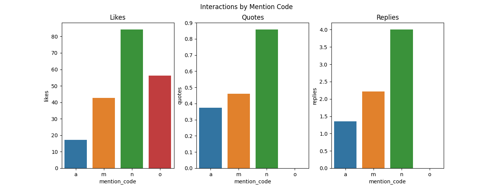
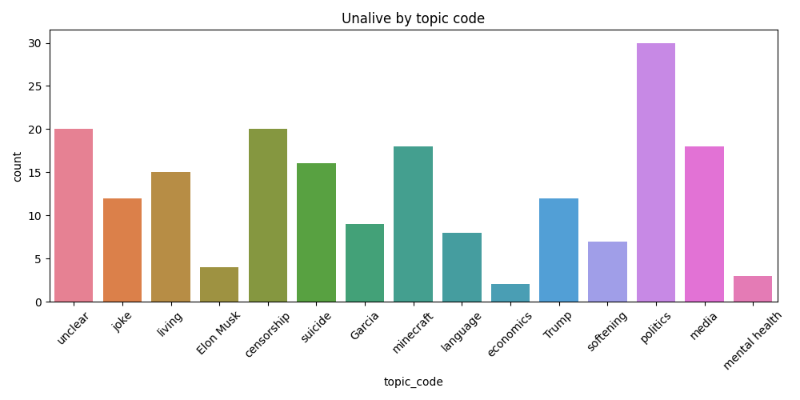
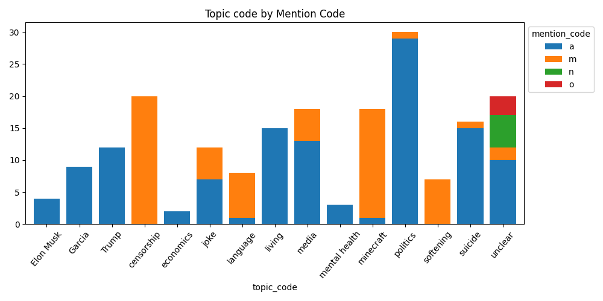

# Final Report - Algospeak on Bluesky
Sara Rosenau
shr144@pitt.edu
4/29/2025

## Background
Today, social media websites and applications are often algorithmically driven. This means that while users can search for content and find content from creators they choose to follow, for the most part, users access content suggested to them by the social media website through code created to sort posts and present them graphically to the user, usually in a single direction such as left to right or vertically. The code that each platform uses is unique to that platform, proprietary, and changes frequently without notice to the users. This code is also opaque and secret, entirely unknown to the userbase and anyone other than the application’s developers. The posts that are shown to users by this code are typically known as algorithmically driven recommendations. 

Social media sites such as TikTok, YouTube, and Twitter/X have been suspected to suppress or remove advertising revenue, known as demonetization, from content containing certain keywords using their algorithms. For example, in 2017, YouTube instituted new, and vague, guidelines about content that might be seen as “Not Advertiser-Friendly”, enforced by AI scanning videos for such content (Dunphy, 2017). Terms of Service agreements for social media platforms can sometimes state that terms referring to suicide and eating disorders may be banned. For example, the TikTok Community guidelines do “not allow showing, promoting, or sharing plans for suicide or self-harm”, disordered eating, or “dangerous activity and challenges” (Community Guidelines | TikTok, 2024).  The removal and suppression of such topics nominally serves to protect the mental health of the user base, especially if it contains many younger people, and also protects the corporation from lawsuits and advertiser boycotts. For instance, if “suicide” is searched on the app, a mental health warning with suicide hotlines will appear.

To circumvent algorithmic suppression and content moderation, social media users have started using what is called *algospeak*. Algospeak was coined by journalist Taylor Lorenz (2022) as a strategy of self-censorship by using alternate words, symbols, and signs to avoid using words that are commonly thought to lead to posts being suppressed by the algorithm. This can surface in several ways, such as using a white emoji (⚪) to represent white people, replacing words with similar characters like *lesbian* becoming *le$bean*, using productive morphology like *unalive* replacing kill and dead, or changing the spelling slightly like *seggs* replacing *sex*. 

This study will be looking at how algospeak is used on the social media platform Bluesky. Bluesky was first launched to users in 2023, primarily marketed as a Twitter replacement after Twitter had been bought by Elon Musk. As a result, Bluesky users are sterotyped as liberal and politcally aware. However, Bluesky has some notable features unlike most other social media platforms. First, Bluesky is built on the AT Protocol, which is designed to be open source and decentralized (Vaughan-Nichols, 2023). Users can fork and adapt the code if they like and they can have the option of self-hosting a server. In addition, Bluesky is centered on feeds, which are customizable and can be created by any user. Instead of having one feed for the accounts you follow and one feed for reccommended posts, Bluesky allows users to have an number of feeds for any topic, such as sports teams, animals, academic topics, etc. Bluesky is then only utilizes recommendation algorithms if the user opts into it, and they can choose what sort of recommendation algorithm they would like to see. As a result, I wanted to see how users of a less algorithmically focused social media platform like Bluesky utilize algospeak, since it is not necessary to circumvent algorithmic suppression.

## Process
The process for this project ended up being quite iterative. The first hurdle of this project ended up being simply figuring out the Bluesky API. The documentation for the API was not particularly beginner-friendly, and having never used an API before, it took some time to figure out. More about this process is in [the first project report](https://github.com/Data-Science-for-Linguists-2025/Algospeak-on-Bluesky/blob/main/progress_report.md#figuring-out-the-api). However, once I figured this out, the technical aspects were quite simple. Initially, I planned on looking at five algospeak terms that I have done other work on, as seen in the table below.

| Algospeak Term    | Gloss                 |
| ----------------- | --------              |
| unalive           | kill, murder, suicide |
| seggs             | sex                   |
| grape             | rape                  |
| palm-colored      | white                 |
| watermelon        | Palestine             |

After collecting around 30 posts for each term, I qualitatively coded them according to how the algospeak term was used. The four codes are below:

| Code      | Meaning                                                                                                               |
|-----------|-----------------------------------------------------------------------------------------------------------------------|
| a         | algospeak - The term is being used to censor another term                                                             |
| m         | mention - The term is being mentioned as an algospeak term but not used to censor anything. Can also stand for "meta" |
| n         | not algospeak - The term is not being used as an algospeak term                                                       |
| o         | other - Term is not present or something else                                                                         |

After visualizing the coded data, I found that only *seggs* and *unalive* were actually being used as algospeak at all. The more ambiguous terms resulted in few, if any, uses as algospeak. As a result, I went back and repeated this process with only data containing the term *unalive*, collecting 199 posts in this data set, as seen in [this notebook](https://nbviewer.org/github/Data-Science-for-Linguists-2025/Algospeak-on-Bluesky/blob/main/getting_unalive_data.ipynb). 

After this, I went back and redid the mention codes, but I also added two new qualitative codes, the replace_code and the topic_code. The replace_code is just the word that *unalive* is replacing, if it is replacing a word. The topic code is the topic of the post that *unalive* is used in. Some more detail on these codes are found in the [code book.](https://github.com/Data-Science-for-Linguists-2025/Algospeak-on-Bluesky/blob/main/code_book.txt) I added these codes so I could more clearly analyze what the algospeak is doing here, and in what contexts people use them in. 

After this, I ran topic modelling on the unalive data. This modelling can be seen in [this notebook.](https://nbviewer.org/github/Data-Science-for-Linguists-2025/Algospeak-on-Bluesky/blob/main/algospeak_topic_modeling.ipynb) Even though I do not have quite enough data to do topic modelling, I wanted to see how it would compare with the qualitative analysis I did by hand. One problem in sociolinguistics is that it is hard to do analysis on larger amounts of data, even though large amounts of data is available, especially online. A side question of this project is to see if computational methods such as topic modelling can aid in this. 

## Data
For the unalive data, I ended up having 199 Bluesky posts, most of them actually containing the word *unalive*, which is unambiguously algospeak. The mention codes for the unalive data are shown in the following graph:

As seen here, most of the posts are using *unalive* as algospeak, while only around 60 of the posts are just mentioning it. This proportion was higher than I expected. As I previously mentioned, Bluesky does not have the algorithmic suppression that creates a need for algospeak, yet people still use it.

To see how other Bluesky users react to these posts, uptake was measured through interactions like replies, likes, and quote posts.

Between the two categories that actually used the algospeak, the posts that mention *unalive* do better than the posts that use *unalive*. This is more in line with previous expectations about algospeak on Bluesky, where metadiscourse would be more prominent.

To see how Bluesky users were using *unalive* to replace other words, I coded each instance for the word it is ostensibly replacing.

This graph shows that *kill* is the most common meaning of unalive while *dead* falls at a distant second. *Die* and *killed* are also possible meanings of *unalive*, showing remarkable linguistic flexability. *Unalive* can be a verb or an adjective, and also be both present and past tense. This is without taking into account other variants like *unalived* or *unaliving*. 

Each post was also coded for the topic of the post. A graph of these topics is below. 

The most common topic is politics, with unclear and censorship tying for second most common. Elon Musk, Garcia, and Trump can also be considered politics, so politics is overwhelmingly the most common topic. This is expected for Bluesky, as it is primarily liberal ex-Twitter users. In third place, minecraft and media tie, showing that not all uses of *unalive* are about politics.

When separated out by mention code, it is clear that most topics are overwhelmingly in one code. For instance, censorship and minecraft are mostly mentions, while political topics are mostly uses of algospeak in earnest. 

## Analysis
### Qualitative Analysis
The data reveals that algospeak, used earnestly, is frequently occurring on Bluesky. The corpus only covers the top posts (though I'm not sure how that is determined) over a time frame a month and a half. Among these posts, *unalive* is more frequently used as algospeak than just mentioned for metadiscourse purposes. As explained above, Bluesky does not primarily rely on recommendation algorithms as other social media sites do, so this is surprising. There is no clear need to use algospeak, as algorithmic suppression is not a concern. Still, algospeak is used on Bluesky. My primary hypothesis is that this is basically a language contact situation between more algorithmic apps like TikTok, and other apps like Bluesky. Users often use multiple social media sites, so they get into the habit of using algospeak on one site, and bring it to another site. In fact, some posts do directly speak on this, such as this post:
>I get why video creators on TikTok and YouTube use "unalive", but it grinds my gears when I see it in comments or places like BlueSky where we're not monetizing our content.

This is a common cause of frustration with algospeak on sites that are not TikTok, so it is not surprising to see it in this data set. 

With regards to topic, the many of the top topics have to do with things that could get suppressed on other social media platforms, such as politics, suicide, and mental health. There are exceptions, such as media and minecraft. Minecraft is its own topic because a character in the Minecraft movie says the word "unalive", and many people posted about this occurance. Of course, all of these posts touch on violence in some way, as *unalive* denotes violence in and of itself. To me, this suggests that beliefs around why algospeak should be used remain in place regardless of the social media site it is used on. If algospeak is used to circumvent suppression on political topics on TikTok, then users will use it for political topics on other platforms as well. 

### Computaitonal Analysis

First, I completed a [KMeans clustering analysis](https://nbviewer.org/github/Data-Science-for-Linguists-2025/Algospeak-on-Bluesky/blob/main/algospeak_topic_modeling.ipynb#2-K-means-clustering) to discover the ideal amount of topics for topic modeling. Then, after using the [NMF model](https://nbviewer.org/github/Data-Science-for-Linguists-2025/Algospeak-on-Bluesky/blob/main/algospeak_topic_modeling.ipynb#3-Topic-Modelling) I had the resulting topics:

**All Unalive Posts:**
| Topic     | Top Words                                                                     |
|-----------|-------------------------------------------------------------------------------|
| 0         | people like say words trying kill just tiktok use way                         |
| 1         | character chungus named general said movie word minecraft say tells           |
| 2         | don know time just wish really want telling live care                         |
| 3         | gonna minecraft unaliving sweaty hate fucking pew say straight movie          |
| 4         | going somebody make right let hard life ups pop constant                      |
| 5         | ll hope shit wrong picking wildlife critter tourists love news                |

**Just a coded posts:**
| Topic     | Top Words                                                                     |
|-----------|-------------------------------------------------------------------------------|
| 0         | people think trying like allowed tell trans hate legally fucking              |
| 1         | going somebody let reason hard make good impact question regret               |
| 2         | really concerned know sorry stuff moment actually instructed harry deflect    |
| 3         | fucker fuck right thing fat wants try bring fact bullshit                     |
| 4         | wish don want care just come happens time government reason                   |
| 5         | hope ll literally book deserves hounded throw 82 hopefully social             |
| 6         | trump touches life miserable risk making coming having hitler hated           |
| 7         | gonna unaliving highkey sweaty doesn minecraft blooded hear believing hot     |

**Just m coded posts:**
| Topic     | Top Words                                                                     |
|-----------|-------------------------------------------------------------------------------|
| 0         | chungus character named general said say word tells called instead            |
| 1         | like say shit things pew murder kill people gonna bullshit                    |
| 2         | minecraft movie saying features unironically sure character movies gonna im   |
| 3         | use words people content creators tiktok youtube video suicide places         |
| 4         | hate sewer slide sounds childish forever fucking term straight im             |
| 5         | just bikini word new dropped saw euphemism silly sanest cutest                |
| 6         | don live know telling omg keeps dude write actually moonshine                 |
| 7         | la en por que inglés vez rrss poco inducción dice                             |

One thing that surprised me was how few topics the KMeans analysis found for the whole corpus. Since there were only 199 posts, this should not be too surprising, but the subsets of the corpus were recommended more topics than the whole. When doing qualitative coding, I found 15 topics, while the KMeans clustering only found 6 for the whole corpus, and 8 for the subsets. That being said, many of the topics found do line up with the topics I identified, mostly on the political side. The m coded topics are more diverse, but because the set of data is so small, it may be picking up individual posts for topics. 

Comapared to my grounded theory coding, I do not think that topic modelling in this project works as well. Some of the topics modelled are recognizable to me *only because* I have already read through each post and thought about how to categorize them. However, this may be because of the small size of the data. It's hard to know how this would work with a larger corpus, but it would probably work better. That being said, 199 is already on the larger side for sociolinguistic analysis. Still, this direction might be worth looking into further with a larger corpus and more time to fine tune everything.

## Conclusion

This project shows that the use of algospeak on Bluesky, despite its differences from other social media platforms, is consistent with how algospeak is used on more algorithmic forms of social media. In addition, this project reveals that topic modelling is not always enough to get at the complexity of qualitative data, at least at small data sizes. 

As someone who is doing other research on algospeak, this is my first foray into analysis of algospeak outside of TikTok. I plan on continuing to look at other social media platforms, as well as the use of algospeak in offline contexts. The conclusion that algospeak is used similarly on Bluesky as on other social media sites is intruiging, and I am interested to see if it holds. 

This project is also one of my first attempts to combine computational methods with sociolinguistic methods, something I am interested in developing further. While this aspect of the project did not work as I hoped, I am curious about how I could improve this methodology or use other similar methodologies for my sociolinguistic research.

## References

Community Guidelines | TikTok. (2024, April 17). https://www.tiktok.com/community-guidelines/en

Dunphy, R. (2017, December 28). Can YouTube Survive the Adpocalypse? Intelligencer. https://nymag.com/intelligencer/2017/12/can-youtube-survive-the-adpocalypse.html

Lorenz, T. (2022, April 11). Internet ‘algospeak’ is changing our language in real time, from ‘nip nops’ to ‘le dollar bean.’ Washington Post. https://www.washingtonpost.com/technology/2022/04/08/algospeak-tiktok-le-dollar-bean/

Vaughan-Nichols, S. (2023, May 16). Bluesky Social just took a big open-source step forward. ZDNET. https://www.zdnet.com/article/bluesky-social-just-took-a-big-open-source-step-forward/

